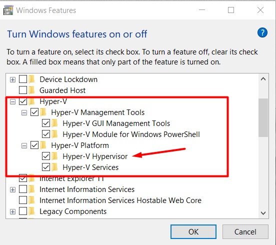
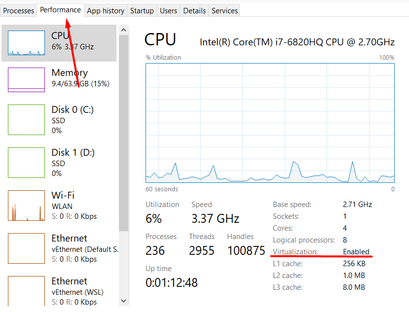

# Installing Windows Subsystem for Linux
If you're on Mac OS or Linux, or already have WSL 2 configured, you can skip this step.

The built-in Windows command line (which we'll explain more later) is terrible. It's so bad that if you're on Windows we're just going to have you install WSL 2 (Windows Subsystem for Linux). This will allow you to use your normal Windows desktop, but also have a Linux command line, operating system, and filesystem for development.

WSL 2 was a huge step forward for developers on Windows, and in my opinion is a much better experience than dual-booting. Don't worry, WSL is a Microsoft product that's built to work with Windows. It won't mess up your current Windows installation.

Here are a couple of things to keep in mind about WSL 2:

* There are two versions of WSL. We will be using the latest: version 2.
* The WSL 2 filesystem is totally separate from your Windows file system. Use your normal windows file system for whatever you normally use it for: games, documents, windows apps, whatever. Use the linux filesystem for your code.

## Install Process
1. Make sure you're on Windows 10 or 11
If you are on an older version, please upgrade. Your life as a developer will not be fun if you're on an older version of Windows.

2. Run Windows Update
Click on the start menu and begin typing "windows update". You should see a program called "Windows Update Settings", open that. Click "check for updates", and if there are any updates, install them and restart your computer as instructed by the updater.

3. Open the Windows Command Prompt and install WSL

    3a. Click on the start menu and begin typing "cmd.exe". You should see a program called "Command Prompt", right-click on it and select "Run as administrator".

    3b. Type wsl --install in the prompt and press enter.

    3c. Restart your computer

4. Turn Windows features on or off

    Verify if Hyper-V is enable on Windows Features. Both Hyper-V Management Tools and Hyper-V Platform must be enabled.

    

    The Hyper-V Hypervisor must be enabled. If it is not do the following:

    * open the "task manager"
    * open the tab performance
    * check whether the virtualization is enabled.

    

    If it is not enabled, you can enable it in the BIOS of your computer. Once you have done this it should work.

5. Setting up the Ubuntu distro

    Ubuntu is a very popular distribution (or distro) of Linux, and it was installed automatically alongside WSL.

    5a. After restarting your computer in step 2, you should see an "Ubuntu" Window open automatically once you log back in. If you don't, search for the "Ubuntu" program in the start menu and launch it.

    5b. The Ubuntu window will prompt you to enter a username and password. Make sure you remember these! These are the credentials for your Linux user.

6. Using WSL in VS Code

    6a. Open VS Code and navigate to the "Extensions" menu on the left hand toolbar.

    6b. Search for and install the "WSL extension by Microsoft".

    6c. In the very bottom-left of VS Code there should be a green button. Click on that and select "New WSL Window using Distro..." and select "Ubuntu".

You should now have a new WSL-ready VS Code editor! You can close the other VS Code window. I recommend pinning this new window to your task bar so that you can always open the WSL-enabled version of VS Code in one click. If you're ever in the "regular" VS Code window you won't have access to your Linux filesystem, so I'd just avoid it completely.

If you have issues, reach out to us for help in the Discord. You can also poke around the official WSL tutorial and the official WSL-Remote VS Code plugin tutorial.